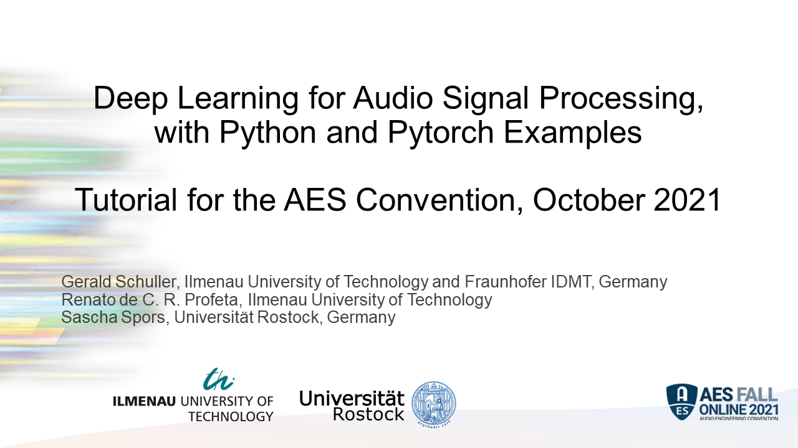

# AES Fall Online 2021 Deep Learning for Audio Tutorial

See also the video at: 
https://www.tu-ilmenau.de/universitaet/fakultaeten/fakultaet-elektrotechnik-und-informationstechnik/profil/institute-und-fachgebiete/fachgebiet-angewandte-mediensysteme/publikationen/tutorials-and-talks

## Content

- Introduction into machine learning for audio

- Best practices

- Convolutional layers as filter, predictor, classifier

- Autoencoders as filter bank with optimization

- Variational autoencoders as audio coder with quantization

- Recurrent Neural Networks as Infinite Impulse Response filters
